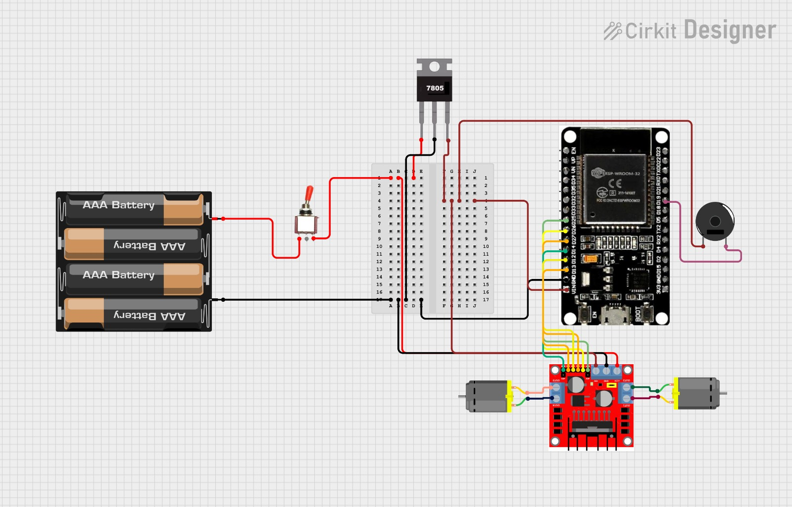

# Histórico de Desenvolvimento do Circuito — Robô Jack

Este documento mostra a evolução do circuito eletrônico do robô **Jack**, desde as primeiras versões de teste até o modelo final utilizado na competição.

---

### 🧪 Circuito Teste 1

O primeiro circuito desenvolvido para o robô **Jack** teve como principal finalidade **representar conceitualmente o sistema eletrônico** do projeto.  
Nesta etapa, ainda não foram realizados testes práticos, com o objetivo sendo apenas **visualizar e planejar** como seria feita a distribuição de energia e o controle básico dos motores.

A proposta dessa montagem foi criar uma **referência visual** que ajudasse a equipe a entender o caminho da alimentação e a função de cada componente, antes de partir para a execução real do protótipo.

#### 🧩 Estrutura e componentes representados
- **Case de 4 pilhas AAA**: escolhido inicialmente para fornecer aproximadamente **9 V**, simulando uma fonte simples e acessível.  
- **Chave liga/desliga (switch)**: adicionada para representar o controle manual de energia.  
- **Regulador de tensão 7805**: responsável por reduzir a tensão de 9 V para 5 V, garantindo segurança à ESP32.  
- **Protoboard**: utilizada como base para a montagem ilustrativa, permitindo visualizar o trajeto dos fios e conexões.  
- **Ponte H (L298N)**: incluída para simular o controle bidirecional dos dois motores DC.  
- **Buzzer**: adicionado como indicação sonora de funcionamento.  
- **ESP32**: microcontrolador principal, representando o núcleo lógico do sistema.

#### 🎯 Objetivo da versão
O propósito desta primeira versão foi **explorar visualmente a arquitetura elétrica** do robô, definindo:
- Como a energia fluiria desde o case de pilhas até a ESP32;  
- Onde seriam posicionados os componentes principais;  
- E como os motores e o buzzer seriam integrados ao controle lógico.

---

### ⚙️ Circuito Teste 2 — Planejamento para Transição à PCB

Nesta segunda etapa, a equipe buscou **aperfeiçoar o planejamento elétrico** do robô **Jack**, avançando do modelo conceitual inicial para uma proposta **mais estruturada e realista**.  
A principal mudança foi a **intenção de substituir o uso da protoboard por uma placa PCB personalizada**, onde os componentes seriam soldados, garantindo maior confiabilidade durante a competição.

O esquema apresentado representa esse novo conceito de organização e distribuição de energia. Embora o circuito não tenha sido montado fisicamente, ele serviu como **base de estudo para o design da futura placa**.

#### 🔧 Estrutura e componentes representados
- **Bateria 18650 (2 unidades em série)**: substituiu o antigo case de pilhas AAA, fornecendo uma **tensão nominal de 7,4 V** e maior autonomia.  
- **Chave liga/desliga (switch)**: manteve-se como controle principal de alimentação.  
- **Regulador de tensão 7805**: responsável por fornecer **5 V estáveis** para o circuito lógico.  
- **Barramentos VCC e GND**: representados pelos terminais azuis, planejados para fazer parte da futura **PCB**, permitindo a distribuição de energia de forma organizada e segura.  
- **Ponte H (L298N)**: utilizada para controle dos dois motores DC.  
- **Buzzer**: mantido como dispositivo sonoro auxiliar.  
- **ESP32**: microcontrolador principal, responsável pela lógica e controle dos motores.  

#### 🎯 Objetivo da versão
O objetivo desta fase foi **planejar a implementação física definitiva do circuito**, simulando:
- A disposição dos componentes sobre a placa;  
- A criação de **barramentos integrados de 5 V e GND**;  
- A eliminação de fios soltos e conexões instáveis típicas de protoboards.  

A ideia era que a futura PCB concentrasse **toda a parte elétrica principal**, incluindo a ESP32, o regulador, os conectores dos motores e o buzzer.

#### ⚙️ Desafios e decisões
Apesar de o conceito ser promissor, a equipe identificou algumas dificuldades práticas:
- O **tamanho da placa** seria considerável, aumentando o peso e a complexidade do robô;  
- O **processo de soldagem** exigiria tempo e precisão elevados;  
- O número de fios e trilhas seria grande, o que aumentava a chance de erro e dificultava a manutenção.

Esses fatores levaram à decisão de **não prosseguir com o uso da PCB** neste estágio, concentrando esforços em buscar uma solução mais compacta e funcional para a alimentação e distribuição de energia.

---

### ⚙️ Circuito Teste 3 — Implementação de Proteções e Uso do Expansor da ESP32

O **Circuito Teste 3** marcou uma das maiores evoluções no projeto eletrônico do robô **Jack**.  
Nesta versão, a equipe focou em **otimizar o espaço físico, melhorar a segurança elétrica e reduzir a quantidade de fios**, aproximando o design do formato que seria utilizado no protótipo final.

Diferente das versões anteriores, este circuito já apresenta uma **configuração mais realista e organizada**, com elementos de proteção e componentes atualizados conforme a disponibilidade no laboratório G.E.A.R.

#### 🔧 Principais mudanças e melhorias
- **Regulador de tensão LM2596:** substituiu o antigo **7805**, já que este não estava disponível no laboratório. O LM2596, além de ser **ajustável e mais eficiente**, dissipa menos calor e garante maior estabilidade.  
- **Interruptor compacto:** adotado no lugar da chave *switch* tradicional, oferecendo **menor consumo de espaço** e melhor integração ao corpo do robô.  
- **Duas medidas de proteção:**  
  - **Fusível** entre a bateria e a **ponte H**, evitando sobrecorrente nos motores;  
  - **Polyfuse (PTC resetável)** em série com o circuito lógico, protegendo a **ESP32 e o regulador** contra curtos e aquecimentos.  
- **Expansor da ESP32:** substituiu a placa simples, funcionando como **protoboard integrada**, o que **reduziu a quantidade de fios** e **facilitou as conexões** de sensores e drivers.  
- **Buzzer** mantido como componente auxiliar de sinalização, agora ligado diretamente ao expansor.

#### 🔋 Organização da alimentação
O novo arranjo manteve o uso de **duas baterias 18650 (7,4 V totais)** como fonte principal, agora com melhor distribuição:
1. A energia passa primeiro pelo **interruptor principal**;
2. Em seguida, é direcionada ao **fusível dos motores** e ao **polyfuse do circuito lógico**;
3. O **regulador LM2596** reduz a tensão para o valor ideal da ESP32 e demais módulos.

Essa configuração tornou o sistema mais seguro, evitando riscos de sobrecarga e incêndio — um passo importante para garantir confiabilidade durante o torneio.

#### ⚙️ Considerações do design
Além das melhorias elétricas, esta versão trouxe uma grande vantagem mecânica: a **eliminação da protoboard**.  
Com o expansor da ESP32, todas as conexões ficaram mais firmes, reduzindo o risco de mau contato e simplificando o layout geral do robô.  

A equipe também pôde visualizar de forma mais clara a **separação das linhas de potência e lógica**, o que facilita futuras manutenções e diagnósticos.

---

### ⚙️ Circuito Teste 4 — Compactação Máxima e Uso de Placas de Servo como Drivers

O **Circuito Teste 4** foi desenvolvido como uma tentativa de **reduzir ao máximo o peso e o volume da eletrônica**, priorizando simplicidade e integração direta com o chassi do robô **Jack**.  
Nesta versão, a equipe buscou eliminar componentes considerados intermediários e avaliar soluções alternativas para o acionamento dos motores.

Diferente das versões anteriores, este circuito foi **montado e testado integralmente**, permitindo observar o comportamento real do sistema sob carga.

#### 🔧 Principais mudanças em relação ao Circuito Teste 3
- **Remoção completa do regulador externo (LM2596):** a alimentação passou a utilizar exclusivamente o **regulador onboard da placa de expansão da ESP32**, reduzindo peso e número de componentes.  
- **Alimentação direta no expansor:** o positivo e o GND da bateria foram ligados diretamente aos **pads inferiores da placa de expansão**, simplificando o caminho da energia.  
- **Substituição da ponte H:** a L298N foi removida e substituída por **duas placas de servo modificadas**, cada uma responsável por acionar um motor DC.  
- **Redução de cabeamento:** com menos módulos intermediários, o circuito passou a utilizar fios mais curtos e em menor quantidade.  

#### 🧩 Estrutura do circuito nesta versão
- **Case de 3 pilhas AA**, utilizado como fonte de energia nesta etapa de testes;  
- **Interruptor liga/desliga**, responsável por energizar todo o sistema;  
- **Placa de expansão roxa da ESP32**, centralizando alimentação e sinais;  
- **ESP32 DevKit**, responsável pelo controle lógico;  
- **Duas placas de servo modificadas**, atuando como drivers simples de motor;  
- **Dois motores DC com redução**, utilizados para ensaios de tração;  
- **Buzzer**, mantido para sinalização sonora.

#### 🔋 Organização da alimentação
A alimentação seguiu uma topologia direta e simplificada:
1. A energia das pilhas passa pelo **interruptor principal**;  
2. O positivo e o GND são conectados diretamente aos **pads da placa de expansão**;  
3. O regulador onboard do expansor fornece as tensões necessárias para a ESP32;  
4. Drivers e buzzer compartilham o **GND comum** do sistema.

#### ⚠️ Limitações observadas nos testes
Apesar de o circuito apresentar funcionamento elétrico estável, os testes práticos revelaram uma limitação crítica:

- As **placas de servo modificadas não forneceram corrente suficiente** para os motores DC;  
- O sistema apresentou **baixo torque**, especialmente em situações de maior carga;  
- O desempenho obtido seria insuficiente para aplicações de **mini-sumô**, onde força e resposta rápida são essenciais.

Devido a essas limitações, o **Circuito Teste 4 não foi adotado como solução final**, servindo apenas como etapa experimental.

#### ⚙️ Considerações finais desta etapa
O Circuito Teste 4 foi importante para demonstrar que:
- A **compactação extrema da eletrônica é viável**, desde que os drivers sejam adequados;  
- O uso de soluções reaproveitadas (como placas de servo) pode funcionar em testes leves, mas **não atende às exigências mecânicas da competição**;  
- A escolha do driver de motor é determinante para o desempenho global do robô.

Os aprendizados obtidos nesta versão direcionaram a equipe para uma solução mais robusta na etapa seguinte do projeto.

---

### ⚙️ Circuito Teste 5 — Retorno à Ponte H e Reorganização para Redução de Peso

O **Circuito Teste 5** marca a transição definitiva para uma solução **mais robusta de acionamento dos motores**, corrigindo as limitações observadas no Circuito Teste 4.  
Nesta etapa, a equipe realizou mudanças estruturais importantes, motivadas principalmente por **problemas de torque, confiabilidade elétrica e restrições severas de peso do chassi**.

Embora a imagem apresentada já utilize **motores N20**, este circuito nasceu em um contexto onde ainda eram utilizados **motores maiores (JGA25-370)**, o que influenciou diretamente as decisões iniciais de simplificação extrema da eletrônica.

#### 🔧 Principais mudanças em relação ao Circuito Teste 4
- **Remoção das placas de servo modificadas:** abandonadas devido à incapacidade de fornecer corrente e torque adequados para os motores em condições reais de combate.  
- **Retorno da ponte H L298N:** reintroduzida como solução de acionamento mais confiável e robusta para os motores DC.  
- **Eliminação da placa de expansão da ESP32:** nesta fase, optou-se por ligar a ESP32 diretamente no terminal 5V da ponte h , buscando reduzir peso e volume da eletrônica.  
- **Uso de um único fusível:** toda a proteção passou a ser feita por **um fusível em série**, conectado da chave diretamente à ponte H.  
- **Simplificação da alimentação:** redução do número de módulos intermediários para minimizar massa e pontos de falha.

#### 🧩 Estrutura do circuito nesta versão
- **Bateria de lítio 2S (≈ 7,4 – 7,8 V)** como fonte principal;  
- **Interruptor liga/desliga**, responsável por energizar todo o sistema;  
- **Fusível único**, instalado entre a chave e a ponte H;  
- **Ponte H L298N**, responsável pelo controle dos dois motores;  
- **ESP32 DevKit**, conectada diretamente à ponte H;  
- **Motores DC**, inicialmente JGA25-370 e posteriormente substituídos por **N20**;  
- **Buzzer**, mantido como dispositivo de sinalização.

#### 🔋 Organização da alimentação
A alimentação foi reorganizada de forma mais direta:
1. A energia da bateria passa pelo **interruptor principal**;  
2. Em seguida, atravessa **um único fusível**, responsável pela proteção do sistema;  
3. A tensão é aplicada diretamente à **ponte H L298N**;  
4. A ESP32 é alimentada a partir do circuito principal, compartilhando **GND comum** com a ponte H.

#### ⚠️ Observações importantes desta etapa
- A **remoção da placa de expansão** foi motivada exclusivamente por preocupações com **peso**, não por limitações funcionais;  
- Durante este período, quase foi adotada uma versão definitiva **sem a placa de expansão**, mesmo após a troca dos motores para N20;  
- A imagem apresentada já reflete uma versão **atualizada com motores N20**, embora o conceito original tenha surgido quando ainda se utilizavam motores maiores.

#### ⚙️ Considerações do design
O Circuito Teste 5 foi essencial para demonstrar que:
- A **ponte H é indispensável** para aplicações que exigem torque e resposta rápida;  
- A busca por redução de peso precisa ser equilibrada com **confiabilidade elétrica**;  
- Algumas simplificações extremas, embora tentadoras, podem comprometer a evolução do projeto;  
- A escolha correta dos motores influencia diretamente toda a arquitetura eletrônica.

Este circuito serviu como **ponte de transição** entre as soluções experimentais e a definição da arquitetura elétrica final do robô.

---

### 🏁 Circuito Final (Oficial) — Versão para Competição

O *Circuito Final* representa a consolidação de todas as decisões técnicas tomadas ao longo do desenvolvimento do robô *Jack, unindo **robustez elétrica, organização física e praticidade de uso* para a competição de mini-sumô.

Com a definição definitiva do uso dos *motores DC N20, tornou-se necessário **reavaliar o balanceamento de peso do robô*, garantindo tração suficiente sem comprometer a confiabilidade do sistema eletrônico.  
Dessa forma, algumas soluções anteriormente descartadas foram *reintroduzidas de forma estratégica*.

#### 🔧 Principais ajustes em relação ao Circuito Teste 5
- *Retorno da placa de expansão da ESP32:* reintroduzida para:
  - auxiliar no *balanceamento de peso* do robô;
  - organizar melhor a distribuição de VCC, GND e sinais;
  - aumentar a robustez mecânica das conexões durante os combates.
- *Manutenção da ponte H L298N:* definida como driver definitivo dos motores N20, garantindo torque adequado e resposta confiável.  
- *Uso de um único fusível:* mantido entre a chave e a ponte H, oferecendo proteção suficiente com menor complexidade.  
- *Inclusão de módulo carregador de bateria de lítio:* permitindo a *recarga direta da bateria*, sem a necessidade de fontes externas ou desmontagem do robô.

#### 🧩 Estrutura do circuito final
- *Bateria de lítio 2S (≈ 7,4 – 7,8 V)* como fonte principal;  
- *Interruptor liga/desliga*, controlando toda a alimentação do sistema;  
- *Fusível único*, protegendo o circuito de potência;  
- *Módulo carregador de bateria de lítio*, conectado diretamente à bateria;  
- *Placa de expansão da ESP32*, utilizada como base física e elétrica;  
- *ESP32 DevKit*, responsável pelo controle lógico e comunicação;  
- *Ponte H L298N*, controlando os dois motores DC N20;  
- *Motores DC N20 com redução*, definidos como solução final de tração;  
- *Buzzer*, utilizado para sinalização sonora.

#### 🔋 Organização da alimentação
A alimentação foi estruturada de forma prática e confiável:
1. A bateria alimenta o sistema através do *interruptor principal*;  
2. O circuito de potência passa por *um único fusível* antes da ponte H;  
3. A *placa de expansão* recebe a alimentação e distribui VCC e GND para a ESP32;  
4. O *módulo carregador* permanece conectado à bateria, permitindo recarga sem alterações no circuito;  
5. Todos os módulos compartilham *GND comum*, garantindo estabilidade dos sinais.

#### ⚙️ Benefícios da configuração final
- *Melhor distribuição de peso*, essencial para o desempenho do mini-sumô;  
- *Conexões mais firmes e organizadas*, reduzindo falhas por vibração ou impacto;  
- *Facilidade de manutenção e recarga*, sem desmontagem do robô;  
- *Arquitetura elétrica estável*, adequada às exigências da competição;  
- Aproveitamento equilibrado entre *simplicidade, robustez e funcionalidade*.

O Circuito Final representa a *versão definitiva utilizada na competição, resultado direto dos aprendizados obtidos ao longo de todas as versões de teste, consolidando uma solução confiável, prática e eficiente para o robô **Jack*.
