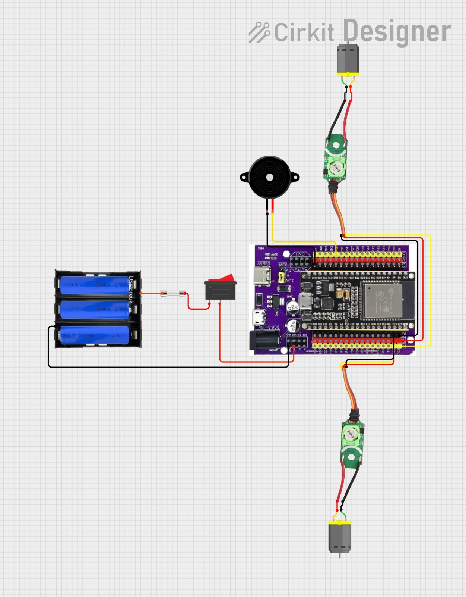

# Histórico de Desenvolvimento do Circuito — Robô Jack

Este documento mostra a evolução do circuito eletrônico do robô **Jack**, desde as primeiras versões de teste até o modelo final utilizado na competição.

---

### 🧪 Circuito Teste 1

O primeiro circuito desenvolvido para o robô **Jack** teve como principal finalidade **representar conceitualmente o sistema eletrônico** do projeto.  
Nesta etapa, ainda não foram realizados testes práticos, com o objetivo sendo apenas **visualizar e planejar** como seria feita a distribuição de energia e o controle básico dos motores.

A proposta dessa montagem foi criar uma **referência visual** que ajudasse a equipe a entender o caminho da alimentação e a função de cada componente, antes de partir para a execução real do protótipo.

#### 🧩 Estrutura e componentes representados
- **Case de 4 pilhas AAA**: escolhido inicialmente para fornecer aproximadamente **9 V**, simulando uma fonte simples e acessível.  
- **Chave liga/desliga (switch)**: adicionada para representar o controle manual de energia.  
- **Regulador de tensão 7805**: responsável por reduzir a tensão de 9 V para 5 V, garantindo segurança à ESP32.  
- **Protoboard**: utilizada como base para a montagem ilustrativa, permitindo visualizar o trajeto dos fios e conexões.  
- **Ponte H (L298N)**: incluída para simular o controle bidirecional dos dois motores DC.  
- **Buzzer**: adicionado como indicação sonora de funcionamento.  
- **ESP32**: microcontrolador principal, representando o núcleo lógico do sistema.

#### 🎯 Objetivo da versão
O propósito desta primeira versão foi **explorar visualmente a arquitetura elétrica** do robô, definindo:
- Como a energia fluiria desde o case de pilhas até a ESP32;  
- Onde seriam posicionados os componentes principais;  
- E como os motores e o buzzer seriam integrados ao controle lógico.

---

### ⚙️ Circuito Teste 2 — Planejamento para Transição à PCB

Nesta segunda etapa, a equipe buscou **aperfeiçoar o planejamento elétrico** do robô **Jack**, avançando do modelo conceitual inicial para uma proposta **mais estruturada e realista**.  
A principal mudança foi a **intenção de substituir o uso da protoboard por uma placa PCB personalizada**, onde os componentes seriam soldados, garantindo maior confiabilidade durante a competição.

O esquema apresentado representa esse novo conceito de organização e distribuição de energia. Embora o circuito não tenha sido montado fisicamente, ele serviu como **base de estudo para o design da futura placa**.

#### 🔧 Estrutura e componentes representados
- **Bateria 18650 (2 unidades em série)**: substituiu o antigo case de pilhas AAA, fornecendo uma **tensão nominal de 7,4 V** e maior autonomia.  
- **Chave liga/desliga (switch)**: manteve-se como controle principal de alimentação.  
- **Regulador de tensão 7805**: responsável por fornecer **5 V estáveis** para o circuito lógico.  
- **Barramentos VCC e GND**: representados pelos terminais azuis, planejados para fazer parte da futura **PCB**, permitindo a distribuição de energia de forma organizada e segura.  
- **Ponte H (L298N)**: utilizada para controle dos dois motores DC.  
- **Buzzer**: mantido como dispositivo sonoro auxiliar.  
- **ESP32**: microcontrolador principal, responsável pela lógica e controle dos motores.  

#### 🎯 Objetivo da versão
O objetivo desta fase foi **planejar a implementação física definitiva do circuito**, simulando:
- A disposição dos componentes sobre a placa;  
- A criação de **barramentos integrados de 5 V e GND**;  
- A eliminação de fios soltos e conexões instáveis típicas de protoboards.  

A ideia era que a futura PCB concentrasse **toda a parte elétrica principal**, incluindo a ESP32, o regulador, os conectores dos motores e o buzzer.

#### ⚙️ Desafios e decisões
Apesar de o conceito ser promissor, a equipe identificou algumas dificuldades práticas:
- O **tamanho da placa** seria considerável, aumentando o peso e a complexidade do robô;  
- O **processo de soldagem** exigiria tempo e precisão elevados;  
- O número de fios e trilhas seria grande, o que aumentava a chance de erro e dificultava a manutenção.

Esses fatores levaram à decisão de **não prosseguir com o uso da PCB** neste estágio, concentrando esforços em buscar uma solução mais compacta e funcional para a alimentação e distribuição de energia.

---

### ⚙️ Circuito Teste 3 — Implementação de Proteções e Uso do Expansor da ESP32

O **Circuito Teste 3** marcou uma das maiores evoluções no projeto eletrônico do robô **Jack**.  
Nesta versão, a equipe focou em **otimizar o espaço físico, melhorar a segurança elétrica e reduzir a quantidade de fios**, aproximando o design do formato que seria utilizado no protótipo final.

Diferente das versões anteriores, este circuito já apresenta uma **configuração mais realista e organizada**, com elementos de proteção e componentes atualizados conforme a disponibilidade no laboratório G.E.A.R.

#### 🔧 Principais mudanças e melhorias
- **Regulador de tensão LM2596:** substituiu o antigo **7805**, já que este não estava disponível no laboratório. O LM2596, além de ser **ajustável e mais eficiente**, dissipa menos calor e garante maior estabilidade.  
- **Interruptor compacto:** adotado no lugar da chave *switch* tradicional, oferecendo **menor consumo de espaço** e melhor integração ao corpo do robô.  
- **Duas medidas de proteção:**  
  - **Fusível** entre a bateria e a **ponte H**, evitando sobrecorrente nos motores;  
  - **Polyfuse (PTC resetável)** em série com o circuito lógico, protegendo a **ESP32 e o regulador** contra curtos e aquecimentos.  
- **Expansor da ESP32:** substituiu a placa simples, funcionando como **protoboard integrada**, o que **reduziu a quantidade de fios** e **facilitou as conexões** de sensores e drivers.  
- **Buzzer** mantido como componente auxiliar de sinalização, agora ligado diretamente ao expansor.

#### 🔋 Organização da alimentação
O novo arranjo manteve o uso de **duas baterias 18650 (7,4 V totais)** como fonte principal, agora com melhor distribuição:
1. A energia passa primeiro pelo **interruptor principal**;
2. Em seguida, é direcionada ao **fusível dos motores** e ao **polyfuse do circuito lógico**;
3. O **regulador LM2596** reduz a tensão para o valor ideal da ESP32 e demais módulos.

Essa configuração tornou o sistema mais seguro, evitando riscos de sobrecarga e incêndio — um passo importante para garantir confiabilidade durante o torneio.

#### ⚙️ Considerações do design
Além das melhorias elétricas, esta versão trouxe uma grande vantagem mecânica: a **eliminação da protoboard**.  
Com o expansor da ESP32, todas as conexões ficaram mais firmes, reduzindo o risco de mau contato e simplificando o layout geral do robô.  

A equipe também pôde visualizar de forma mais clara a **separação das linhas de potência e lógica**, o que facilita futuras manutenções e diagnósticos.

---

### ⚙️ Circuito Teste 4 — Versão Final Simplificada com Placas de Servo

O **Circuito Teste 4** representa a **versão final e mais otimizada** do sistema eletrônico do robô **Jack**.  
Nesta configuração, o foco principal foi **reduzir o peso total do robô, simplificar as conexões e eliminar componentes desnecessários**, sem comprometer a segurança ou a eficiência elétrica.  
O resultado foi um circuito leve, confiável e funcional, perfeitamente adaptado para as dimensões do robô mini-sumô.

#### 🔋 Mudanças principais
- **Bateria com 3 células AA:** substituiu as antigas baterias 18650, oferecendo uma solução mais compacta e leve, com **tensão nominal de 3,7 V** — valor adequado para o funcionamento do expansor e dos motores.  
- **Eliminação da Ponte H (L298N):** foi substituída por **duas placas de servo modificadas**, reaproveitadas de servomotores comuns.  
  Essas placas funcionam como **drivers simples de motor**, controladas diretamente pela ESP32.  
- **Placas de servo como drivers:** cada motor DC passou a ser controlado individualmente por uma placa de servo, recebendo o sinal PWM da ESP32.  
  Isso reduziu o número de fios e o tamanho do circuito, mantendo um controle estável e eficiente.  
- **Buzzer ativo:** manteve-se ligado à ESP32, atuando como alerta sonoro durante a inicialização e operação.  
- **Uso do expansor da ESP32:** seguiu como o núcleo da parte eletrônica, com o diferencial de permitir **soldagem direta de alimentação e GND** na parte inferior da placa.

#### ⚙️ Estrutura elétrica e ligações diretas
Uma das decisões mais importantes nesta versão foi **eliminar completamente o uso de um regulador de tensão externo**.  
O **fio positivo proveniente do interruptor** foi soldado diretamente no **pino de entrada DC do expansor** (localizado na parte inferior da placa), o qual possui **suporte para até 16 V** e já contém **regulagem interna de tensão**.  
O **fio GND** também foi soldado diretamente no pino correspondente da parte inferior do expansor.

Esse método trouxe várias vantagens:
- **Redução de peso**, já que o regulador LM2596 foi removido;  
- **Menor número de fios expostos**, com conexões mais curtas e diretas;  
- **Aproveitamento do regulador onboard** do expansor, que fornece automaticamente as tensões adequadas (5 V e 3,3 V) para a ESP32 e periféricos;  
- **Maior confiabilidade elétrica**, com menos pontos de falha e menor queda de tensão.

#### 🧠 Organização geral do circuito
1. **Case de 3 pilhas AA** → **interruptor principal** → **entrada DC do expansor** (soldada diretamente).  
2. **Regulador interno do expansor** fornece 5 V e 3,3 V para a ESP32 e para os sinais lógicos.  
3. **Drivers (placas de servo)** são alimentados diretamente pela linha de VCC, compartilhando o mesmo **GND comum**.  
4. **GPIO22 e GPIO23** controlam os motores esquerdo e direito, respectivamente.  
5. **GPIO2** é utilizado para o buzzer.

#### 💡 Benefícios finais
- Circuito mais **leve**, **limpo** e **fácil de montar**;  
- **Menor dissipação de calor** e maior eficiência;  
- **Menos fios e menor risco de desconexão** durante o combate;  
- Utilização inteligente dos **recursos nativos do expansor da ESP32**;  
- Estrutura elétrica compacta, ideal para o robô mini-sumô.
